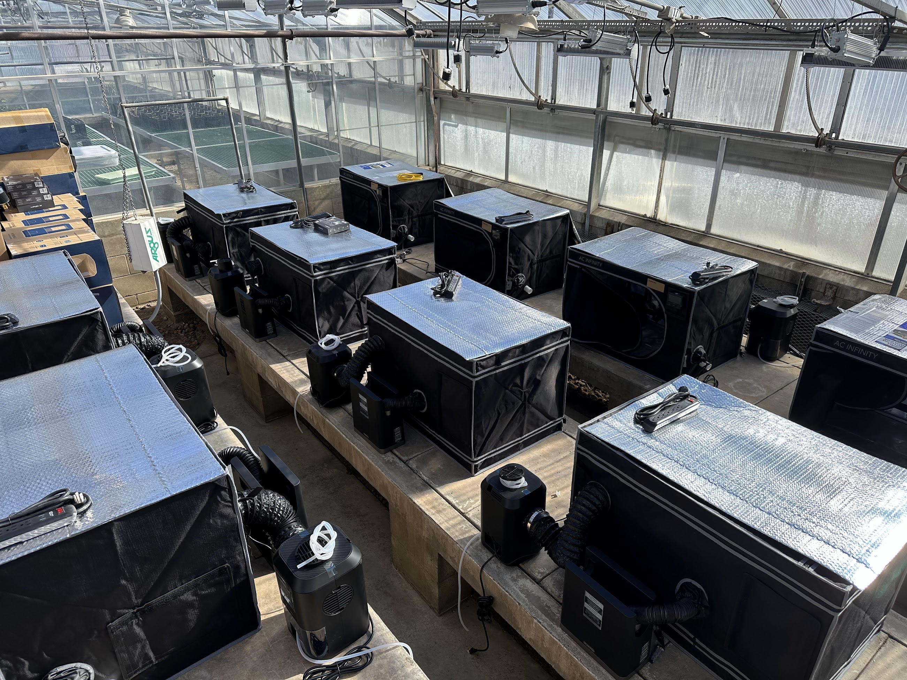
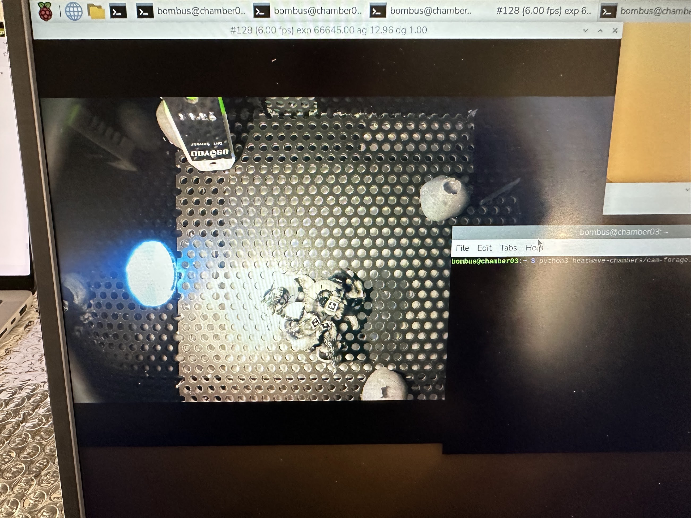
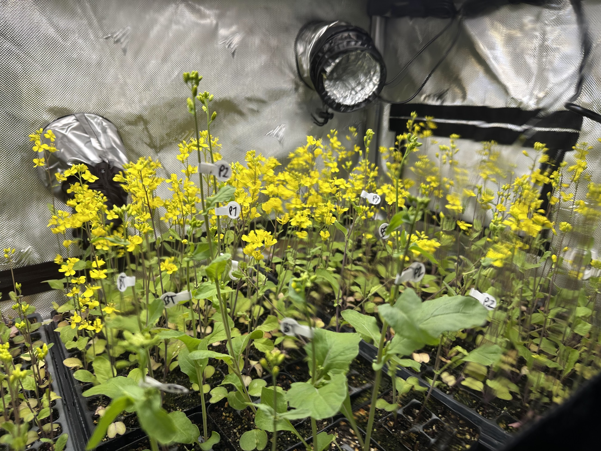

It's been just over a year since the iBUG lab officially "opened" at the University of Minnesota. Over the last 12 months, we've been clearing out old spaces, buying and building new desks, figuring out new purchasing systems, and slowly putting the pieces together to do some cool new science. It's been a learning experience, especially for me, but I'm proud of where things are now and what we're starting to do.

In February of 2026, we launched our first major experiment - partnering with colleague [Nick Rosenberger](https://jhemberger.github.io/ibug_lab_website/people/rosenberger-nick/) at the University of Freiburg to follow up on some of our past work exploring how heat waves impact plant-pollinator interactions. Together, along with lab manager Haidyn Larson, we put together an ambitious experiment to understand how heat wave itensity and duration impacts pollination and plant reproduction. Like our past work, we have been examining both the direct effects of heat on the plant, as well as the indirect effects through foraging pollinators change reproductive output. This experiment builds off our previous work by explicitly considering the dimension of heat wave duration (i.e., time of exposure) in addition to how hot heat waves actually get (i.e., heat wave intensity). This is critcal because, much like toxicological exposure, its not just how much of a stressor a system is exposed to, but also how long it is exposed that dictates outcomes. 

To tease apart these various components, we've been using a [response surface](https://esajournals.onlinelibrary.wiley.com/doi/10.1890/0012-9658%282001%29082%5B2696%3ARSEDFI%5D2.0.CO%3B2) design for our experiment. This is a departure from our previous work, which has used factorial designs (e.g., a 2 x 2 design with plant and pollinator exposure to two different temperature levels) to parse apart the various effect components. Response surface designs allow us to create generalizable, mechanistic models of how ecological systems respond to global change drivers, such as temperature. In particular, response surface designs allow us to test the impact of many temperatures and durations aiding in the development of predictions of how systems will respond to future conditions. A distinct advantage of this design is that we don't strictly need to replicate each treatment combination of temperature and duration: we treat them as interacting, *continuous* variables rather than categorical variables in an ANOVA-style design. This essentially amounts to a complex interaction of two non-linear processes (temperature and duration, see Figure 1 for an example using temperature and CO~2~). Because of this, [we can test treatment combinations that may currently seem "unrealistic"](https://www.sciencedirect.com/science/article/pii/S1369527422000352?via%3Dihub), but may become commonplace as the climate continues to change - enhancing our capacity to predict pollination into the future. 

, depicting the advantage of response surface designs over traditional, ANOVA designs*](./response-surfaces.jpg){}

We've been working on a response surface experiment with 8 temperatures (10, 15, 20, 25, 30, 35, 40, and 45°C) and 6 exposure durations (1, 2, 3, 4, 5, and 6 days) to explore both the impact of cold, normal, and heat wave temperatures (spanning basically the entire thermal performance curve of our study organisms). These conditions are simulated for flowering rapid cycling *Brassica rapa* and foraging bumble bees for both open- and hand-pollinated plants. We've been using some awesome new heat wave chambers to conduct these trials, and will wrap up the experiment this coming winter (2026).

::: {.grid .gap-3}
::: {.g-col-12 .g-col-md-4}
{fig-cap="Caption 1" width="100%" .lightbox}
:::

::: {.g-col-12 .g-col-md-4}
{fig-cap="Caption 2" width="100%" .lightbox}
:::

::: {.g-col-12 .g-col-md-4}
{fig-cap="Caption 3" width="100%" .lightbox}
:::
:::

<iframe src="https://www.youtube.com/embed/dEBrNpuV8Wo"
        width="100%" height="400"
        frameborder="0"
        allowfullscreen>
</iframe>