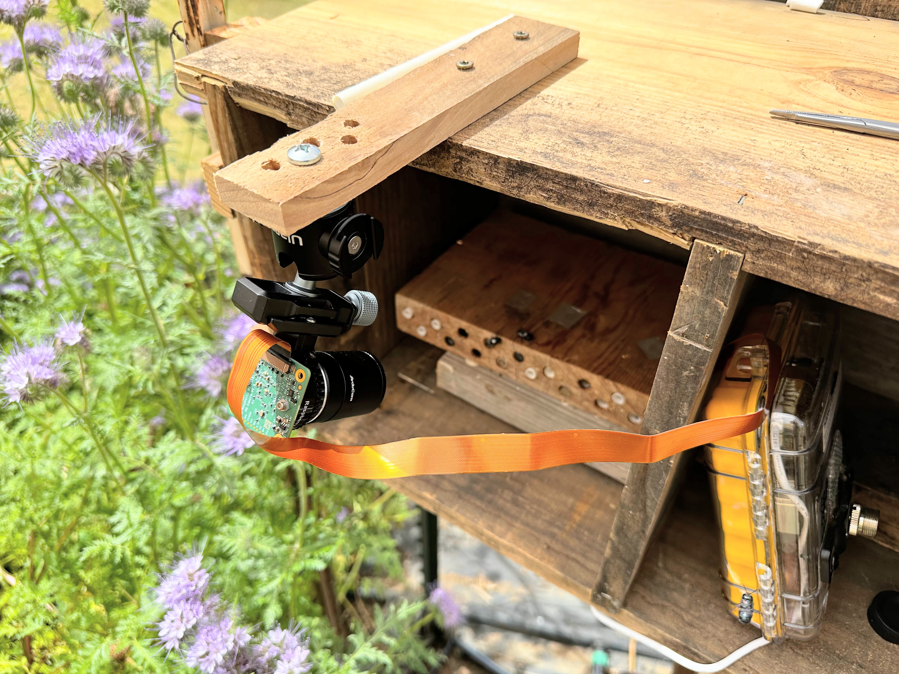
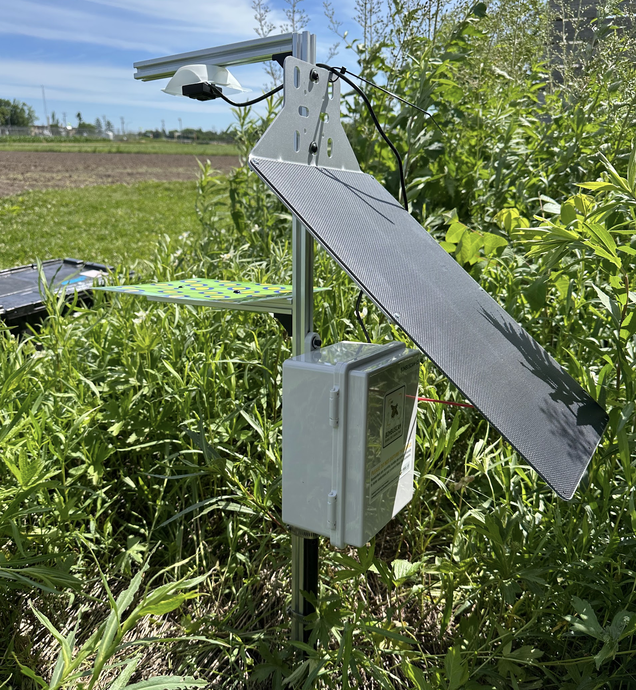

In late May of this year, we found out that an ~$1.2 million NSF grant we've been working on for several years was selected for funding! This project, a collaboration between the iBUG lab, the [Williams Lab at UC Davis](https://williamslab.ucdavis.edu/) and the [Winfree Lab at Rutgers](https://winfreelab.com/research/), is a 3-year effort to understand how wild bees respond and develop resilience to heat waves.

![**Figure 1:** Conceptual overview of the project. The hypothesized impacts of heat waves on the focal study species the solitary bee *Osmia lignaria*, across the stages of its life history (upper panel). Spring heat waves boost adult and larval performance/activity by moving temperatures closer to thermal optima, increasing reproductive success. In contrast, summer heat waves can exceed pupal and diapausing adult thermal optima, increasing mortality. In Obj. 1, we use controlled experiments to measure how heat waves affect O. lignaria eggs, larvae, and adults. In Obj. 2, we will measure nesting rates in the field using experimentally manipulated nest block microhabitat and marked individual *O. lignaria* to measure heat wave impacts in the wild. We expect to find greater resilience to heat waves in nature because bees can behaviorally adapt using cooler microhabitats for nesting and foraging. In Obj. 3, we expand our focus to bee communities and use AI-assisted cameras to determine whether different wild bee genera vary in their sensitivity to heat waves. Such variability would confer additional resilience at the community scale, as compared with the single-species scale.](fig1.png)

 

## Project abstract
The pollination services bees provide are threatened by extreme weather events — most dramatically, by heat waves. Despite the threats heat waves pose, previous research has been limited to controlled laboratory studies on a handful of bee species. This limited context precludes mechanisms that could buffer pollination services against heat waves in natural settings. Understanding such mechanisms could help guide strategies for supporting the integrity of natural systems and improving food security. Our project bridges the study of individuals, populations and communities and leverages cutting-edge technology to better understand organism responses to the environment. First, the project measures behavior, reproduction and survival of individual bees across life stages, in response to simulated heat waves (Figure 1, Objective 1). Second, the project tracks nesting bees in the wild using automated remote cameras to determine whether bees within a population choose cooler nest locations under heat wave conditions (Figure 1, Objective 2). Third, the project uses AI-assisted camera traps to measure the activity of whole native bee communities before, during, and after naturally occurring heat waves (Figure 1, Objective 3). Spanning detailed study of individual bees to observations of multiple bee species over hundreds of square kilometers, can reveal the scale at which resilience emerges and buffers bees to extreme temperatures. This project also will develop newly-available technologies with promise to make environmental monitoring vastly more efficient and engage public audiences through museum educational program at the University of Minnesota.

 

::: {.grid .gap-2}
::: {.g-col-12 .g-col-md-6}
{.lightbox height="300px"}

**Figure 2:** Prototype camera to monitor *Osmia* nesting activity in response to ambient temperatures
:::

::: {.g-col-12 .g-col-md-6}
{.lightbox height="300px"}

**Figure 3:** Wild bee camera trap prototype for monitoring whole bee communities response to heat waves
:::
:::

We'll be starting field work for this in Spring of 2027 and will soon be looking for a postdoc to help lead the first two objectives of the project. Stay tuned for details of that position to be posted. I'll also be attending the Entomology Society of America meetings in November and will be meeting with prospective postdocs there. Please contact me if you're interested. 