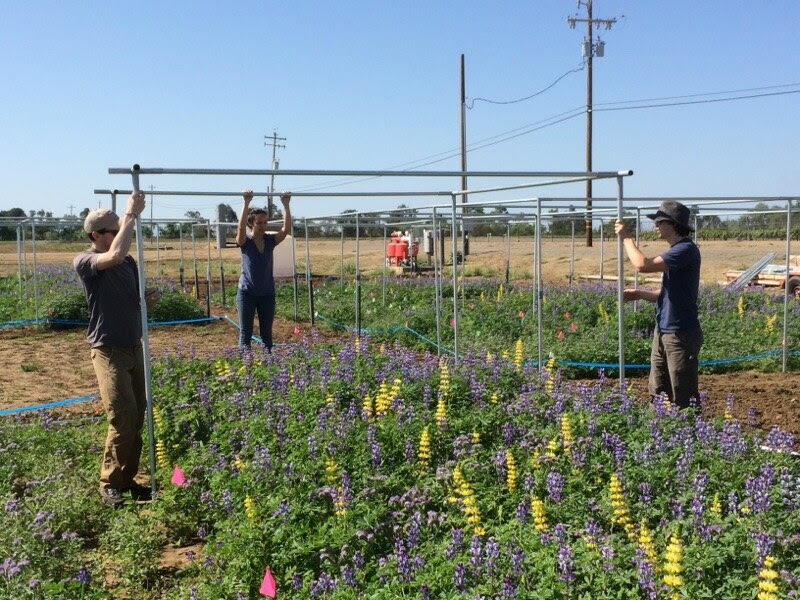
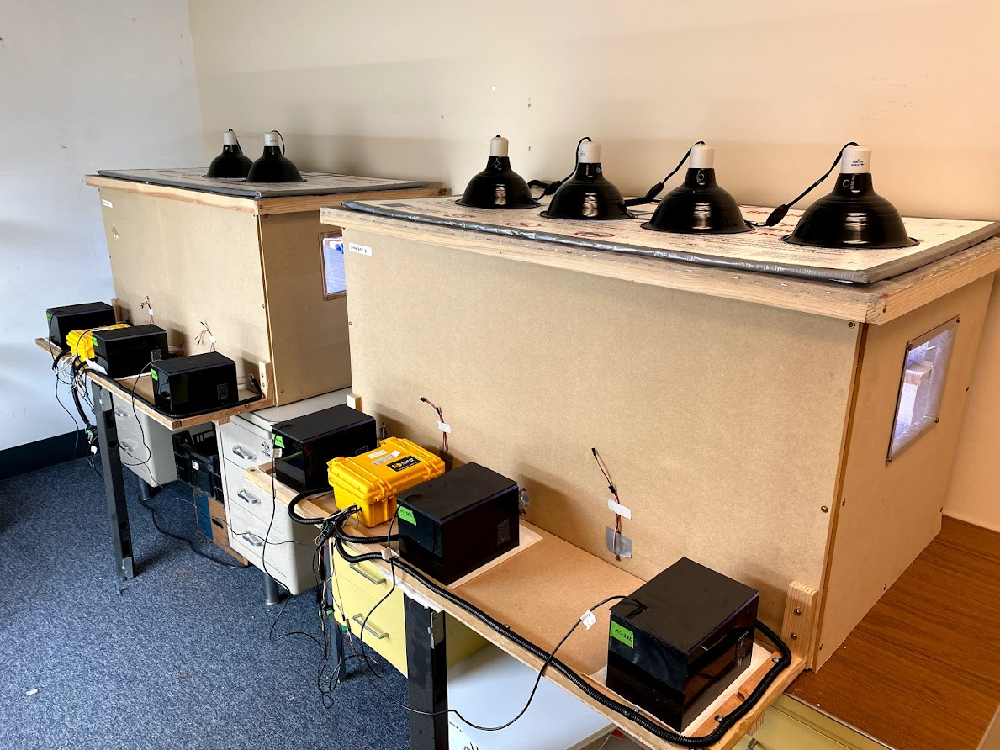

## Current openings
We're not currently recruiting students or postdocs for existing positions. However, if you are interested in collaborating on a project or proposal as a prospective student or postdoc, please reach out to me!

<!-- 
:::{.hire-alert}
###  Postdoctoral researcher
The iBUG lab is recruiting a postdoctoral researcher for an NSF funded project (2 years of guaranteed funding) investigating emergent resilience mechanisms of wild bees to heat waves across scales of biological organization. Greenhouse and field work using *Osmia lignaria* in California in collaboration with Neal Williams (UC Davis) and Rachel Winfree (Rutgers). Hosted at UMN.

[ Apply via UMN Jobs Portal](https://hr.myu.umn.edu/jobs){.btn .btn-primary role="button"}
[ Read project summary](media/opportunities/nsf-summary.pdf){.btn .btn-primary role="button"}
:::

 

:::{.hire-alert}
###  Camera trap technician 
The iBUG lab is recruiting a researcher to assist with insect camera trap development and data management. The position will involve designing, building, and maintaining the fleet of active research camera traps in addition to building data processing pipelines in coordination with collaborators at other institutions. 

[Apply via UMN Jobs Portal](https://hr.myu.umn.edu/jobs){.btn .btn-primary role="button"}
:::

-->

 

::::{.research-callout1}
### What qualities make for successful students?

When recruiting staff and students, I am hoping to build a collaborative partnership where we can learn and grow together as scientists. I'm looking for students broadly interested in insect ecology and global change who able to see the work they do, even if foundational, from an applied perspective. There are many attributes that will help motivate successful candidates including curiosity, creativity, problem solving capacity, good communication skills (broadly defined), self-motivation, a vision for how a graduate degree with help advance their career and personal goals, and a *genuine interest and enthusiasm for the scientific endeavor*. Academia can be a fickle, frustrating, and fraught experience. Science moves slow, there are perennial funding challenges, experiments rarely go as planned, and the list goes on. All of the challenges are, at least somewhat, balanced by the excitement and freedom to pursue the knowledge and questions that we find most fascinating. It's important to remember that science is a team sport, but there is still a high-degree of intrinsic motivation required to persevere through its many challenges. It's also important to know that no one arrives with all of the skills needed to succeed in grad school: they develop through time, effort, feedback, and having grace for yourself as a developing scientist.

Take a look at this [great article on applying to graduate school](https://esajournals.onlinelibrary.wiley.com/doi/10.1002/bes2.1917) for tips on preparing a successful application and determining whether a graduate degree is right for you.

::: {layout="[1,1,1,1]"}
{.lightbox}

{.lightbox}

{.lightbox}

{.lightbox}
:::
::::